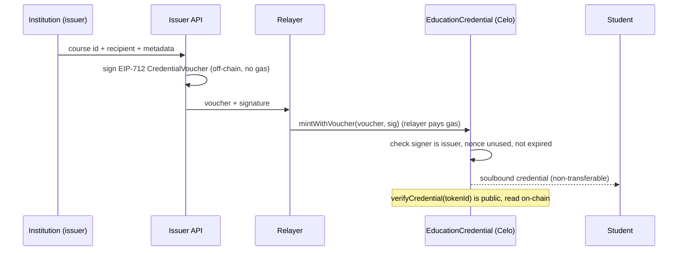

# Celo Credentials: gasless soulbound education credentials

A full-stack reference dApp on **Celo** (EVM L2) that issues **soulbound ERC-721**
education credentials. An institution signs an **EIP-712 voucher** off-chain; a
**relayer pays the gas**, so the student receives a verifiable, non-transferable
credential **without holding any funds**. Anyone can verify a credential on-chain.

> A compact, security-minded reference implementation: a Foundry-tested contract,
> a JavaScript backend (issuer + relayer + indexer), and a TypeScript/Next.js frontend.

## Live on Celo Sepolia

| | |
|---|---|
| Contract | [`0xCE6A729c96C6c5f61d90E0139bCF929A777CCAC7`](https://celo-sepolia.blockscout.com/address/0xCE6A729c96C6c5f61d90E0139bCF929A777CCAC7) (fully verified source) |
| Source | [`4522300`](https://github.com/Musyg/celo-credentials-dapp/commit/45223008a45c140780e8eb2d7c31dbdb79af33fe) |
| Deployment | [tx `0x042a7a...43aa`](https://celo-sepolia.blockscout.com/tx/0x042a7a4a0a5d1db5bdb746c9120aed590ea571b7859eb06b9b875f1e90ee43aa) |
| Issuer authorization | [tx `0x66a22a...020f`](https://celo-sepolia.blockscout.com/tx/0x66a22a351c4409d27680068a7bc04ffd51a51ba2e63454dce62600ca9411020f) |
| Credential issuance | [tx `0xdf4e40...87e2`](https://celo-sepolia.blockscout.com/tx/0xdf4e4077b30adaecb6864f7122acf3fd496313944dac468ce36e9d5fa62387e2), token #1, course `20260816` |
| Credential revocation | [tx `0xf85b12...4ee1`](https://celo-sepolia.blockscout.com/tx/0xf85b12f0bbed58d62ff5f12405f403a24d9bb1bb567dfe38971f0c60d5724ee1) |
| Final public state | token #1: zero holder, original issuer retained, `revoked = true` |
| Network | Celo Sepolia (chain id `11142220`) |

The linked lifecycle demonstrates owner-controlled issuer authorization, EIP-712 voucher
issuance, public verification, and revocation on the deployed source. The machine-readable
record is in [`deployment-celo-sepolia.json`](deployment-celo-sepolia.json).

The active and revoked states can be reproduced from public chain history:

```powershell
$rpc = "https://forno.celo-sepolia.celo-testnet.org"
$contract = "0xCE6A729c96C6c5f61d90E0139bCF929A777CCAC7"

# Active immediately after issuance.
cast call $contract "verifyCredential(uint256)(address,uint256,address,bool)" 1 `
  --block 33604321 --rpc-url $rpc

# Revoked after the lifecycle proof.
cast call $contract "verifyCredential(uint256)(address,uint256,address,bool)" 1 `
  --block 33604915 --rpc-url $rpc
```

## How it works



## Security properties

- **Soulbound:** transfers blocked in `_update`; only mint and burn (revoke) allowed.
- **Replay protection:** each voucher carries a single-use `nonce` and a `deadline`,
  bound to the contract via the EIP-712 domain separator (chain id + verifying contract).
- **Signature integrity:** OpenZeppelin `ECDSA` rejects malleable signatures; the
  recovered signer must be an authorized issuer.
- **Authorization:** only owner-approved addresses (`setIssuer`) can issue; `revoke`
  is restricted to the owner or the active issuer that created the credential.
- **Public verifiability:** `verifyCredential` returns holder, course, issuer and
  revocation status straight from chain state.

11/11 Foundry tests cover minting, the soulbound revert, replay and expiry reverts,
unauthorized signer, issuer-bound revocation paths, and a mint fuzz run.

GitHub Actions checks the Solidity formatting, build, and test suite; validates the
backend JavaScript syntax; audits production backend dependencies; and builds the
TypeScript/Next.js frontend for production.

## Monorepo layout

```
.
├── src/ test/ script/    Solidity contract, tests, and deployment script
├── backend/              Express API: voucher signing, gasless relay, Postgres indexer (viem)
└── frontend/             Next.js (App Router) + wagmi: connect, mint, my credentials, verify
```

## Run it locally

**Contracts**
```bash
git submodule update --init --recursive   # forge-std + OpenZeppelin
forge test                                # 11/11 passing
```

**Backend** (`backend/`)
```bash
cp .env.example .env  # set ISSUER_PRIVATE_KEY, RELAYER_PRIVATE_KEY (DATABASE_URL optional)
npm ci
npm run check         # static syntax validation
npm run e2e           # live proof: sign -> relay -> mint -> verify on Celo Sepolia
npm start             # API on :8130
```

**Frontend** (`frontend/`)
```bash
cp .env.example .env.local
npm ci
npm run build         # production build + TypeScript validation
npm run dev           # http://localhost:3000
```

## Redeploy the current contract

The deployment script is locked to Celo Sepolia (`11142220`) and checks that the
deployed owner matches `INITIAL_OWNER`. Keep the testnet deployer in an encrypted
Foundry keystore. Never pass a private key on the command line or commit it to the
repository.

```powershell
# One-time local setup. Both prompts are hidden.
cast wallet import celo-sepolia-deployer --interactive

$env:CELO_SEPOLIA_RPC_URL = "https://forno.celo-sepolia.celo-testnet.org"
$env:INITIAL_OWNER = "0xYOUR_CELO_SEPOLIA_WALLET_ADDRESS"

# Simulate first. This does not broadcast a transaction.
forge script script/DeployEducationCredential.s.sol:DeployEducationCredential `
  --rpc-url $env:CELO_SEPOLIA_RPC_URL `
  --account celo-sepolia-deployer `
  --sender $env:INITIAL_OWNER

# Broadcast and submit the exact deployed source to Celo Sepolia Blockscout.
forge script script/DeployEducationCredential.s.sol:DeployEducationCredential `
  --rpc-url $env:CELO_SEPOLIA_RPC_URL `
  --account celo-sepolia-deployer `
  --sender $env:INITIAL_OWNER `
  --broadcast `
  --verify `
  --verifier blockscout `
  --verifier-url https://celo-sepolia.blockscout.com/api/
```

The account address used by `--sender` must match the imported keystore. After the
broadcast, preserve the contract address, deployment transaction, verified source
page, owner read-back, and the public issuance and revocation transactions.

## API

| Method | Route | Purpose |
|---|---|---|
| `POST` | `/api/voucher` | Issuer signs an EIP-712 voucher (off-chain, no gas) |
| `POST` | `/api/relay` | Relayer submits the voucher and pays gas |
| `GET` | `/api/verify/:tokenId` | On-chain verification of a credential |
| `GET` | `/api/credentials/:address` | A holder's credentials (from the indexer) |
| `GET` | `/health` | Service + config status |

## Stack

Solidity 0.8.x · OpenZeppelin v5 · Foundry · viem · Express · PostgreSQL ·
Next.js 16 · React 19 · wagmi 3 · TypeScript · Celo (EVM L2).

---

*Testnet demo. Secrets in `.env` files are never committed. Not independently audited for production use.*
