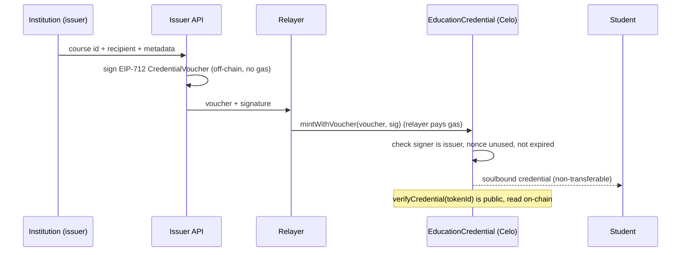

# Celo Credentials — gasless soulbound education credentials

A full-stack reference dApp on **Celo** (EVM L2) that issues **soulbound ERC-721**
education credentials. An institution signs an **EIP-712 voucher** off-chain; a
**relayer pays the gas**, so the student receives a verifiable, non-transferable
credential **without holding any funds**. Anyone can verify a credential on-chain.

> A compact, security-minded reference implementation: a Foundry-tested contract,
> a JavaScript backend (issuer + relayer + indexer), and a TypeScript/Next.js frontend.

## Live on Celo Sepolia

| | |
|---|---|
| Contract | [`0x3Ed7b04b5B0dE9CaD355A229FE503C9e5711CdE0`](https://sepolia.celoscan.io/address/0x3ed7b04b5b0de9cad355a229fe503c9e5711cde0#code) (verified source) |
| Sample mint (gasless) | [tx `0x0069e4…ba14c`](https://sepolia.celoscan.io/tx/0x0069e47a4e84f2fa54103a815dca47f3c9f0133b63c1c9bf8dce61662f8ba14c) |
| Sample credential | [token #2](https://sepolia.celoscan.io/token/0x3Ed7b04b5B0dE9CaD355A229FE503C9e5711CdE0?a=2) |
| Network | Celo Sepolia (chain id `11142220`) |

> Deployment status: this address is the original v1 reference deployment. The current
> source includes issuer-bound revocation authorization and is pending a new testnet deployment.

## How it works



## Security properties

- **Soulbound** — transfers blocked in `_update`; only mint and burn (revoke) allowed.
- **Replay protection** — each voucher carries a single-use `nonce` and a `deadline`,
  bound to the contract via the EIP-712 domain separator (chain id + verifying contract).
- **Signature integrity** — OpenZeppelin `ECDSA` rejects malleable signatures; the
  recovered signer must be an authorized issuer.
- **Authorization** — only owner-approved addresses (`setIssuer`) can issue; `revoke`
  is restricted to the owner or the active issuer that created the credential.
- **Public verifiability** — `verifyCredential` returns holder, course, issuer and
  revocation status straight from chain state.

11/11 Foundry tests cover minting, the soulbound revert, replay and expiry reverts,
unauthorized signer, issuer-bound revocation paths, and a mint fuzz run.

GitHub Actions checks the Solidity formatting, build, and test suite; validates the
backend JavaScript syntax; audits production backend dependencies; and builds the
TypeScript/Next.js frontend for production.

## Monorepo layout

```
.
├── src/ test/            Solidity contract + Foundry tests
├── backend/              Express API: voucher signing, gasless relay, Postgres indexer (viem)
└── frontend/             Next.js (App Router) + wagmi: connect, mint, my credentials, verify
```

## Run it locally

**Contracts**
```bash
git submodule update --init --recursive   # forge-std + OpenZeppelin
forge test                                # 11/11 passing
```

**Backend** (`backend/`)
```bash
cp .env.example .env  # set ISSUER_PRIVATE_KEY, RELAYER_PRIVATE_KEY (DATABASE_URL optional)
npm ci
npm run check         # static syntax validation
npm run e2e           # live proof: sign -> relay -> mint -> verify on Celo Sepolia
npm start             # API on :8130
```

**Frontend** (`frontend/`)
```bash
cp .env.example .env.local
npm ci
npm run build         # production build + TypeScript validation
npm run dev           # http://localhost:3000
```

## API

| Method | Route | Purpose |
|---|---|---|
| `POST` | `/api/voucher` | Issuer signs an EIP-712 voucher (off-chain, no gas) |
| `POST` | `/api/relay` | Relayer submits the voucher and pays gas |
| `GET` | `/api/verify/:tokenId` | On-chain verification of a credential |
| `GET` | `/api/credentials/:address` | A holder's credentials (from the indexer) |
| `GET` | `/health` | Service + config status |

## Stack

Solidity 0.8.x · OpenZeppelin v5 · Foundry · viem · Express · PostgreSQL ·
Next.js 14 · wagmi · TypeScript · Celo (EVM L2).

---

*Testnet demo. Secrets in `.env` files are never committed. Not independently audited for production use.*
